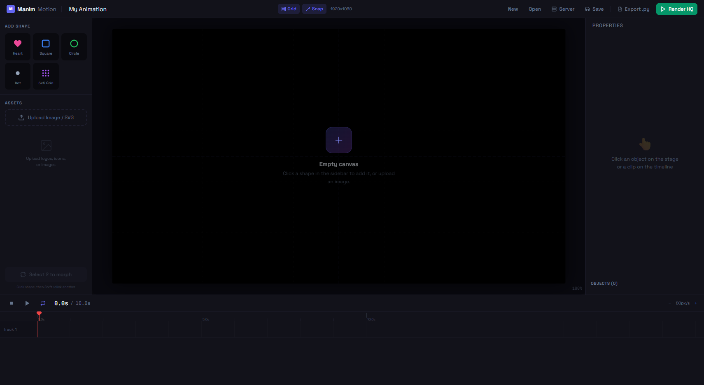
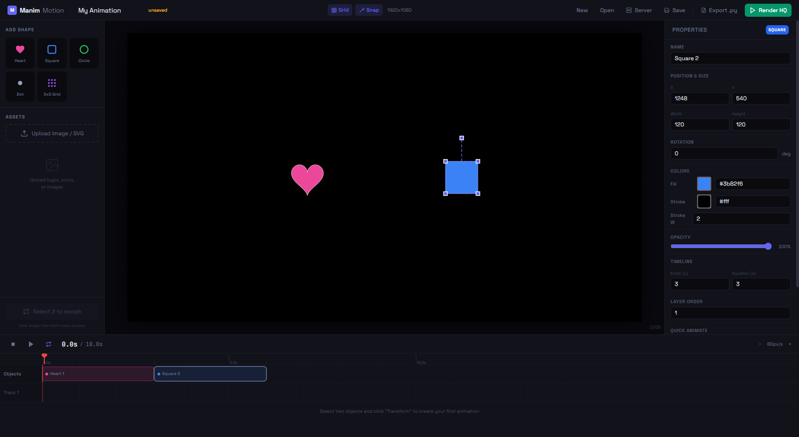
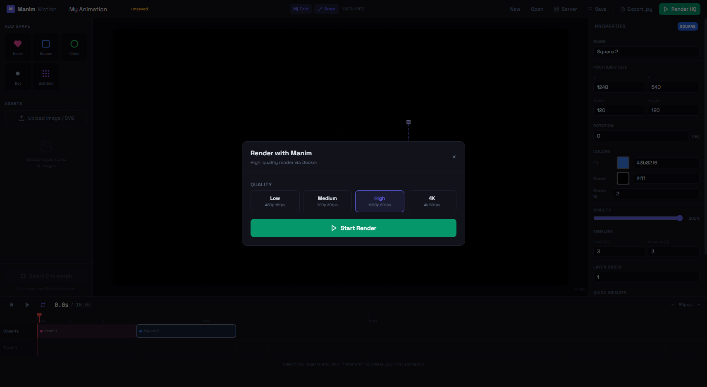
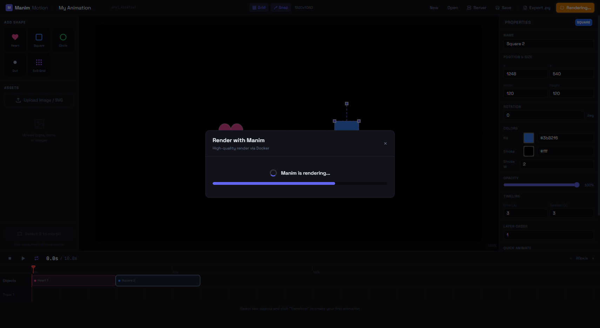
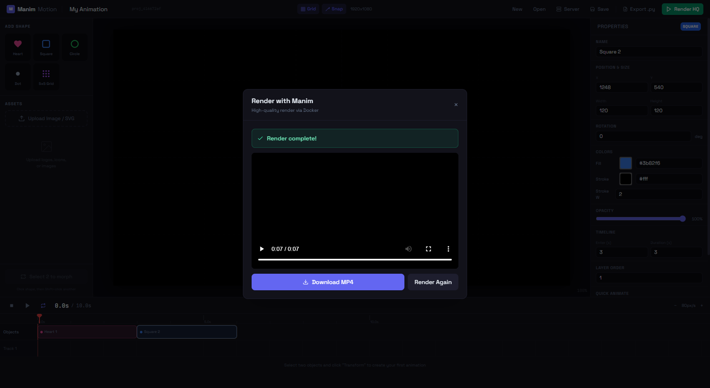

<div align="center">
  
  
  # Manim Motion Editor
  
  A **Figma-like interactive motion editor** with **high-quality Manim rendering** via Docker. Build animations visually: drag shapes onto a stage, create transform morphs between objects, edit timelines with multiple tracks, preview at 60fps, and render cinematic HQ videos -- all from your browser.
</div>


---

## Screenshots

### Empty canvas -- clean starting state


### Shapes on stage with properties panel


### One-click HQ render dialog


### Manim rendering in progress


### Render complete with video preview + download


---

## Features

- **Visual Stage Editor** -- Black canvas with optional grid, drag-and-drop shapes, resize/rotate handles, multi-select
- **Shape Library** -- Heart, Square, Circle, Dot, 5x5 Dot Grid, plus uploaded images and SVGs
- **Transform Morphing** -- Select two shapes and morph between them with customizable easing
- **Multi-Track Timeline** -- Up to 5 tracks with draggable, resizable animation clips
- **Real-Time Preview** -- 60fps playback with sub-frame interpolation
- **Animation Types** -- Transform, Move, Scale, Fade, Rotate with 17 easing functions
- **Asset Management** -- Upload PNGs, JPEGs, SVGs; drag onto stage from sidebar
- **Server Rendering** -- One-click HQ render via Docker (480p to 4K) with progress tracking
- **Export Options** -- Download Manim Python scripts or render server-side
- **Project Management** -- Save/load locally (JSON) or sync to Docker server
- **Live Code View** -- Toggle between Timeline and Code in the bottom panel to see generated Manim Python in real-time
- **Keyboard Shortcuts** -- Space (play/pause), V (select), H (hand/pan), Delete, Ctrl+S (save)

---

## Quick Start

### Full Stack with Docker (Recommended)

```bash
git clone <repository-url>
cd Manim-docker
docker compose up --build
```

Open **http://localhost:8080** in your browser. Everything works out of the box -- editor, API, render queue, and Manim renderer.

### Editor Only (No Docker)

```bash
cd services/web
npm install
npm run dev
```

Open **http://localhost:5173**. You can edit, preview, and export Manim scripts. Server features (render, project sync) require Docker.

---

## Architecture

```
Browser (localhost:8080)
  |
  |-- Nginx (serves Vue SPA, proxies /api/)
  |
  |-- Vue 2 + Konva.js
  |     |-- Stage Canvas (shapes, grid, morphs, transformer)
  |     |-- Properties Panel (object/clip editing)
  |     |-- Timeline (multi-track, drag clips)
  |     |-- Asset Sidebar (shapes, uploads)
  |     |-- Playback Engine (60fps rAF)
  |     |-- Manim Exporter (client-side .py generation)
  |
  |-- /api/ --> Node.js + Express (port 3000)
  |     |-- Project CRUD (JSON on shared volume)
  |     |-- Asset upload (multipart + base64)
  |     |-- Compiler: validate -> normalize -> codegen (scene.py)
  |     |-- Render trigger -> Redis queue
  |
  |-- Redis (job queue)
  |
  |-- Manim Renderer (Python worker)
        |-- Polls Redis for jobs
        |-- Runs: manim -qh scene.py MainScene
        |-- Outputs MP4 to shared volume
        |-- Updates job status in Redis
```

**Shared Docker volume** (`studio_data` at `/data`):
- `projects/` -- Project JSON + generated `scene.py`
- `assets/` -- Uploaded images/SVGs per project
- `renders/` -- Output MP4 files per project

---

## How It Works

### 1. Add Shapes
Click shapes in the left sidebar. They appear on the stage and on the timeline's Objects row.

### 2. Position and Style
Drag shapes on the canvas. Edit fill, stroke, opacity, size, rotation in the Properties panel.

### 3. Create Animations
- **Transform**: Select two shapes (click + Shift+click), then click "Create Transform"
- **Quick Animate**: Select one shape, click Move/Scale/Fade/Rotate in the Properties panel

### 4. Edit Timeline
- Drag clips to change start time
- Resize clip edges to change duration
- Click clips to edit easing, overshoot, morph quality

### 5. Preview
Press **Space** to play the animation at 60fps. Scrub the timeline ruler to seek.

### 6. Render
Click **Render HQ** in the top bar. Choose quality (Low/Medium/High/4K) and click Start Render. The project is saved to the server, compiled to a Manim scene, and rendered. When done, watch the preview and download the MP4.

### 7. Live Code View
Click the **Code** tab in the bottom panel to see the generated Manim Python code update in real-time as you add shapes and animations. You can copy or download the code directly from there.

### 8. Export
Click **Export .py** to download a standalone `scene.py` you can run locally with `manim -qh scene.py MainScene`.

---

## Data Model

```
Project
 +-- id, name, sceneDuration
 +-- stage: { width, height, backgroundColor, grid*, snap* }
 +-- objects[]: { id, type, name, x, y, width, height, rotation,
 |               fill, stroke, opacity, zOrder, enterTime, duration,
 |               enterAnim, exitAnim, assetId? }
 +-- tracks[]: { id, name, clips[] }
 |    +-- clip: { id, type, startTime, duration, easing,
 |                sourceId, targetId?, params, overshoot, morphQuality }
 +-- assets[]: { id, name, type, filename, dataUrl?, width, height }
```

**Clip types**: `transform` (morph A->B), `move`, `scale`, `fade`, `rotate`

**Easing functions** (17): linear, ease_in, ease_out, ease_in_out, cubic/quart variants, back variants, elastic in/out, bounce, spring

---

## API Reference

| Method | Endpoint | Description |
|--------|----------|-------------|
| `GET` | `/api/projects` | List all projects |
| `POST` | `/api/projects` | Create new project |
| `GET` | `/api/projects/:id` | Get project by ID |
| `PUT` | `/api/projects/:id` | Update project |
| `DELETE` | `/api/projects/:id` | Delete project + assets + renders |
| `POST` | `/api/projects/:id/render` | Compile + enqueue render job |
| `POST` | `/api/assets/:projectId` | Upload file (multipart) |
| `POST` | `/api/assets/:projectId/base64` | Upload base64 data URL |
| `GET` | `/api/assets/:projectId/:filename` | Serve asset file |
| `GET` | `/api/jobs/:jobId` | Poll render job status |
| `GET` | `/api/renders/:projectId/latest.mp4` | Stream latest render |
| `GET` | `/health` | Health check |

---

## Project Structure

```
Manim-docker/
+-- docker-compose.yml
+-- services/
    +-- web/                          # Vue frontend
    |   +-- src/
    |   |   +-- App.vue               # Root: dialogs, shortcuts
    |   |   +-- api.js                # API client
    |   |   +-- store/project.js      # State + server actions
    |   |   +-- engine/               # Playback engine
    |   |   |   +-- geometry.js       # Shape point generation
    |   |   |   +-- easing.js         # 17 easing functions
    |   |   |   +-- transform.js      # Morph interpolation
    |   |   |   +-- playback.js       # rAF loop
    |   |   |   +-- blending.js       # Multi-track blending
    |   |   +-- export/manim.js       # Client-side .py generator
    |   |   +-- components/
    |   |       +-- topbar/           # Project name, controls, render
    |   |       +-- sidebar/          # Shapes, assets, transform
    |   |       +-- stage/            # Konva canvas
    |   |       +-- inspector/        # Properties panel
    |   |       +-- timeline/         # Tracks, clips, playback
    |   +-- nginx.conf
    |   +-- Dockerfile
    |
    +-- api/                          # Node.js backend
    |   +-- src/
    |   |   +-- index.js              # Express server
    |   |   +-- queue.js              # Redis queue
    |   |   +-- routes/               # REST endpoints
    |   |   +-- compiler/             # Manim code generation
    |   |       +-- validator.js      # Zod schema validation
    |   |       +-- normalizer.js     # Data normalization
    |   |       +-- codegen.js        # Python code generation
    |   +-- Dockerfile
    |
    +-- renderer/                     # Manim worker
        +-- worker.py                 # Redis consumer + manim exec
        +-- Dockerfile
```

---

## Docker Services

| Service | Image | Port | Purpose |
|---------|-------|------|---------|
| **web** | nginx:alpine | 8080 | Vue SPA + API proxy (runs as non-root `nginx` user) |
| **api** | node:20-alpine | 3000 | REST API, compiler (runs as non-root `node` user) |
| **renderer** | manimcommunity/manim | -- | Render worker |
| **redis** | redis:7-alpine | 6379 | Job queue |
| **init** | alpine:3.19 | -- | Creates /data dirs |

### Security

All Docker containers run with **least-privilege non-root users**:
- **web** service runs as `nginx` user (UID 1000)
- **api** service runs as `node` user (UID 1000)
- File permissions are properly set with `--chown` flags during build
- `/app` and `/data` directories are owned by their respective service users

### Production-Grade Reliability

- **Resource Limits**: Renderer service is capped at 2 CPUs and 4GB RAM to prevent host crashes
- **Health Checks**: All services have configured healthchecks (API pings `/health`, renderer checks Python runtime)
- **Auto-Restart**: Services automatically restart on failure with exponential backoff
- **Service Dependencies**: Proper startup order ensures database and data directories exist before app starts

### Render Quality

| Quality | Flag | Resolution | FPS |
|---------|------|------------|-----|
| Low | `-ql` | 480p | 15 |
| Medium | `-qm` | 720p | 30 |
| High | `-qh` | 1080p | 60 |
| 4K | `-qk` | 4K | 60 |

### Environment Variables

- `DATA_DIR` -- Shared volume path (default: `/data`)
- `REDIS_URL` -- Redis connection (default: `redis://redis:6379`)
- `PORT` -- API port (default: `3000`)

---

## Running Tests

```bash
cd services/web
npm test
```

30+ assertions covering easing functions, point resampling, timeline scheduling, and blending logic.

---

## Troubleshooting

**Render fails?**
- Check `docker compose logs renderer` for Manim errors
- Ensure all services are running: `docker compose ps`

**API not reachable?**
- `curl http://localhost:3000/health` should return `{"status":"ok"}`
- Check `docker compose logs api`

**Images not loading?**
- Upload images via the sidebar (they're stored as base64 in the browser)
- When rendering, assets are automatically synced to the server

**Playback stutters?**
- Reduce morph quality in clip properties
- Close browser DevTools
- Use Chrome/Edge for best V8 performance

---

## Keyboard Shortcuts

| Key | Action |
|-----|--------|
| `Space` | Play / Pause |
| `V` | Select tool |
| `H` | Hand (pan) tool |
| `Delete` | Delete selected object/clip |
| `Escape` | Deselect all, close dialogs |
| `Ctrl+S` | Save to file |
| `Shift+Click` | Multi-select objects |
| `Scroll` | Zoom canvas |

---

## Tech Stack

- **Frontend**: Vue 2.7, Konva.js, Tailwind CSS, Vite
- **Backend**: Node.js 20, Express, Multer, Zod, Redis
- **Renderer**: Python, Manim Community Edition
- **Infrastructure**: Docker Compose, Nginx, Alpine Linux

---

## Documentation

For complete technical documentation of the entire codebase, see **[XTRA-BIG-README.md](XTRA-BIG-README.md)** which includes:
- Detailed architecture diagrams
- Complete API reference with examples
- Data models and TypeScript interfaces
- File-by-file breakdown of all 51 source files
- Component documentation
- Animation engine internals
- Compiler pipeline details
- Development guide and troubleshooting

---

## License

MIT

---

## Acknowledgments

- [Manim Community Edition](https://www.manim.community/) -- Mathematical animation engine
- [Vue.js](https://vuejs.org/) -- Progressive JavaScript framework
- [Konva.js](https://konvajs.org/) -- 2D canvas library
- [Tailwind CSS](https://tailwindcss.com/) -- Utility-first CSS
